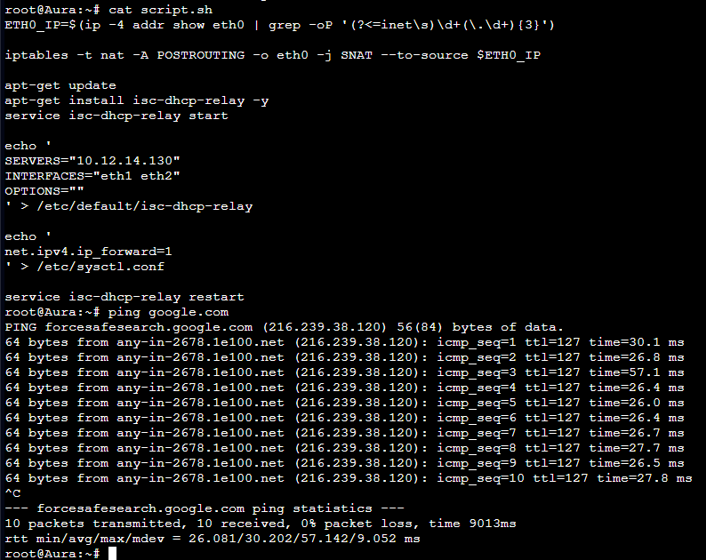
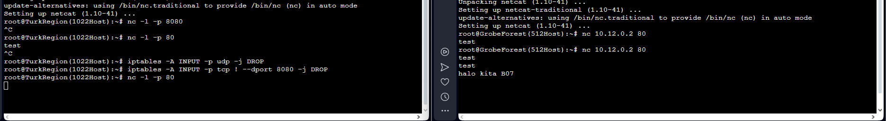
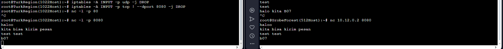
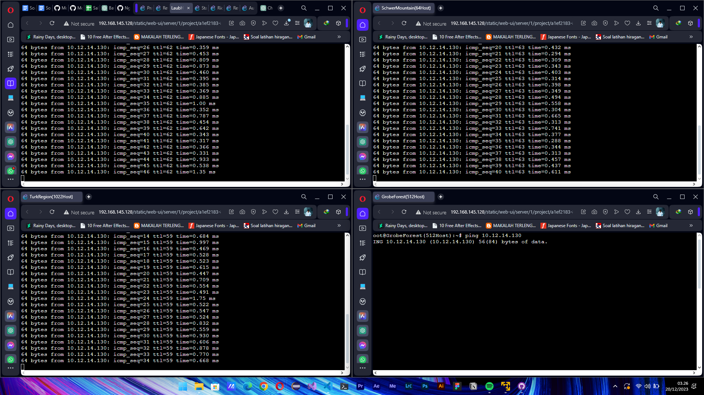
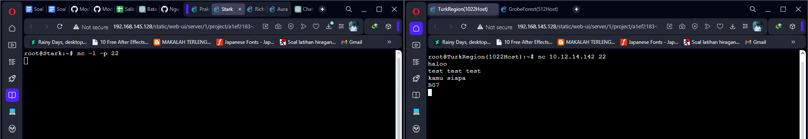

# Jarkom-Modul-5-B07-2023
> Laporan Resmi Praktikum 5 Jaringan Komputer B07
***
## Anggota Kelompok B07

| Nama                      | NRP        | Kelas                |
| ------------------------- | ---------- | ----------------     |
| I Gusti Ngurah Ervan Juli Ardana | 5025211205 | Jaringan Komputer B  |
| Danar Sodik Priyambodo    | 5025211145 | Jaringan Komputer B  |

## Daftar isi

- [Tahap Persiapan](#tahap-persiapan)
  - [Syarat A](#syarat-a)
    - [Topologi VLSM](#topologi-vlsm)
    - [Topologi GNS](#topologi-gns)
  - [Syarat B](#syarat-b)
    - [Rute](#rute)
    - [Tree](#tree)
    - [Pembagian IP](#pembagian-ip)
  - [Syarat C](#syarat-c)
    - [Subnetting](#subnetting)
    - [Routing](#routing)
  - [Syarat D](#syarat-d)
    - [Konfigurasi DHCP Server](#konfigurasi-dhcp-server)
    - [Konfigurasi DHCP Relay](#konfigurasi-dhcp-relay)
    - [Konfigurasi DNS Server](#konfigurasi-dns-server)
    - [Konfigurasi Web Server](#konfigurasi-web-server)
    - [Konfigurasi Client ](#konfigurasi-client)
- [Tahap Persoalan](#tahap-persoalan)
  - [Soal 1](#soal-1)
  - [Soal 2](#soal-2)
  - [Soal 3](#soal-3)
  - [Soal 4](#soal-4)
  - [Soal 5](#soal-5)
  - [Soal 6](#soal-6)
  - [Soal 7](#soal-7)
  - [Soal 8](#soal-8)
  - [Soal 9](#soal-9)
  - [Soal 10](#soal-10)

---

## Tahap Persiapan

## Syarat A
Tugas pertama, buatlah peta wilayah sesuai yang diberikan pada soal
### Topologi VLSM


### Topologi GNS


## Syarat B
### Rute
Setelah membagi topologi menjadi beberapa subnet, kemudian kami dapat membagi rute dan menghitung jumlah IP pada masing masing subnet. Berikut merupakan pembagian Rute dan jumlah IP pada masing masing subnet


### Tree
Setelah mengetahui pembagian IP dan Rute dari masing masing Subnet, kita bisa membentuk tree untuk membagi IP ke masing masing subnet


### Pembagian IP
Setelah membentuk Tree, kami dapat melanjutkan dengan membagi IP pada masing masing subnet


## Syarat C
### Subnetting
Setelah mengetahui pembagian IP dari masing masing subnet, sekarang kami dapat melakukan subnetting pada masing masing node yang ada dalam setiap subnet.

#### Aura
```
auto eth0
iface eth0 inet dhcp

auto eth1
iface eth1 inet static
	address 10.12.14.145
	netmask 255.255.255.252

auto eth2
iface eth2 inet static
	address 10.12.14.149
	netmask 255.255.255.252
```
#### Heiter
```
auto eth0
iface eth0 inet static
	address 10.12.14.150
	netmask 255.255.255.252
	gateway 10.12.14.149

auto eth1
iface eth1 inet static
	address 10.12.8.1
	netmask 255.255.252.0

auto eth2
iface eth2 inet static
	address 10.12.0.1
	netmask 255.255.248.0
```
#### Frieren
```
auto eth0
iface eth0 inet static
	address 10.12.14.146
	netmask 255.255.255.252
	gateway 10.12.14.145

auto eth1
iface eth1 inet static
	address 10.12.14.137
	netmask 255.255.255.252

auto eth2
iface eth2 inet static
	address 10.12.14.141
	netmask 255.255.255.252
```
#### Himmel
```
auto eth0
iface eth0 inet static
	address 10.12.14.138
	netmask 255.255.255.252
	gateway 10.12.14.137

auto eth1
iface eth1 inet static
	address 10.12.14.1
	netmask 255.255.255.128

auto eth2
iface eth2 inet static
	address 10.12.12.1
	netmask 255.255.254.0
```
#### Fern
```
auto eth0
iface eth0 inet static
	address 10.12.14.3
	netmask 255.255.255.128
	gateway 10.12.14.1

auto eth1
iface eth1 inet static
	address 10.12.14.133
	netmask 255.255.255.252

auto eth2
iface eth2 inet static
	address 10.12.14.129
	netmask 255.255.255.252
```
#### Sein
```
auto eth0
iface eth0 inet static
	address 10.12.8.2
	netmask 255.255.252.0
	gateway 10.12.8.1
```
#### Stark
```
auto eth0
iface eth0 inet static
	address 10.12.14.142
	netmask 255.255.255.252
	gateway 10.12.14.141
```
#### Revolte
```
auto eth0
iface eth0 inet static
	address 10.12.14.130
	netmask 255.255.255.252
	gateway 10.12.14.129
```
#### Richter
```
auto eth0
iface eth0 inet static
	address 10.12.14.134
	netmask 255.255.255.252
	gateway 10.12.14.133
```
#### Client
```
auto eth0
iface eth0 inet dhcp
```

### Routing
Setelah melakukan subnetting pada masing masing node yang ada, Selanjutnya kami bisa melakukan Routing:

#### Aura
```
route add -net 10.12.0.0 netmask 255.255.248.0 gw 10.12.14.150 (A9)
route add -net 10.12.8.0 netmask 255.255.252.0 gw 10.12.14.150 (A10)
route add -net 10.12.14.140 netmask 255.255.255.252 gw 10.12.14.146 (A6)
route add -net 10.12.14.136 netmask 255.255.255.252 gw 10.12.14.146 (A5)
route add -net 10.12.12.0 netmask 255.255.254.0 gw 10.12.14.146 (A4)
route add -net 10.12.14.0 netmask 255.255.255.128 gw 10.12.14.146 (A3)
route add -net 10.12.14.132 netmask 255.255.255.252 gw 10.12.14.146 (A2)
route add -net 10.12.14.128 netmask 255.255.255.252 gw 10.12.14.146 (A1)
```
#### Heiter
```
route add -net 0.0.0.0 netmask 0.0.0.0 gw 10.12.14.149
```
#### Frieren
```
route add -net 0.0.0.0 netmask 0.0.0.0 gw 10.12.14.145
route add -net 10.12.12.0 netmask 255.255.254.0 gw 10.12.14.138  (A4)
route add -net 10.12.14.0 netmask 255.255.255.128 gw 10.12.14.138  (A3)
route add -net 10.12.14.132 netmask 255.255.255.252 gw 10.12.14.138  (A2)
route add -net 10.12.14.128 netmask 255.255.255.252 gw 10.12.14.138  (A1)
```
#### Himmel
```
route add -net 0.0.0.0 netmask 0.0.0.0 gw 10.12.14.137 
route add -net 10.12.14.132 netmask 255.255.255.252 gw 10.12.14.3 (A2)
route add -net 10.12.14.128 netmask 255.255.255.252 gw 10.12.14.3 (A1)
```
#### Fern
```
route add -net 0.0.0.0 netmask 0.0.0.0 gw 10.12.14.1
```

## Syarat D
### Konfigurasi DHCP Server

```
echo nameserver 192.168.122.1 > /etc/resolv.conf

apt-get update
apt-get install isc-dhcp-server -y
dhcpd --version
apt-get install netcat -y

service isc-dhcp-server start

echo '
INTERFACES="eth0"
' > /etc/default/isc-dhcp-server

echo '
option domain-name "example.org";
option domain-name-servers ns1.example.org, ns2.example.org;

default-lease-time 600;
max-lease-time 7200;

ddns-update-style none;

subnet 10.12.14.128 netmask 255.255.255.252 {
    option routers 10.12.14.129;
}

subnet 10.12.14.132 netmask 255.255.255.252 {
}

subnet 10.12.14.136 netmask 255.255.255.252 {
    option routers 10.12.14.136;
}

subnet 10.12.14.140 netmask 255.255.255.252 {
}

subnet 10.12.14.144 netmask 255.255.255.252 {
    option routers 10.12.14.145;
}

subnet 10.12.14.148 netmask 255.255.255.252 {
    option routers 10.12.14.150;
}

subnet 10.12.12.0 netmask 255.255.254.0 {
    range 10.12.12.2 10.12.13.1;
    option routers 10.12.12.1;
    option broadcast-address 10.12.13.255;
    option domain-name-servers 10.12.14.134;
    default-lease-time 720;
    max-lease-time 5760;
}

subnet 10.12.14.0 netmask 255.255.255.128 {
    range 10.12.14.4 10.12.14.67;
    option routers 10.12.14.1;
    option broadcast-address 10.12.14.127;
    option domain-name-servers 10.12.14.134;
    default-lease-time 720;
    max-lease-time 5760;
}

subnet 10.12.0.0 netmask 255.255.248.0 {
    range 10.12.0.2 10.12.4.4;
    option routers 10.12.0.1;
    option broadcast-address 10.12.7.255;
    option domain-name-servers 10.12.14.134;
    default-lease-time 720;
    max-lease-time 5760;
}

subnet 10.12.8.0 netmask 255.255.252.0 {
    range 10.12.8.3 10.12.10.5;
    option routers 10.12.8.1;
    option broadcast-address 10.12.11.255;
    option domain-name-servers 10.12.14.134;
    default-lease-time 720;
    max-lease-time 5760;
}
' > /etc/dhcp/dhcpd.conf

service isc-dhcp-server restart
```

Berikut merupakan konfigurasi dari revolte yang merupakan DHCP server yang berfungsi untuk menyetor ip dinamis kepada client yang mengininkan ip pada range tertentu, terdapat setting pada `/etc/dhcp/dhcpd.conf` pada 4 subnet yaitu subnet pada client yang menginginkan dinamis. kemudian sisa dari subnet yang terdapat sedikit setting merupakan jalur yang dilewati dhcp untuk menuju subnet yang diinginkan.

### Konfigurasi DHCP Relay

```
echo nameserver 192.168.122.1 > /etc/resolv.conf

apt-get update
apt-get install isc-dhcp-relay -y
service isc-dhcp-relay start

echo '
SERVERS="10.12.14.130"
INTERFACES="eth0 eth1 eth2"
OPTIONS=""
' > /etc/default/isc-dhcp-relay

echo '
net.ipv4.ip_forward=1
' > /etc/sysctl.conf

service isc-dhcp-relay restart
```

DHCP relay dubutuhkan untuk melakukan forward ip dinamis yang sampai papda router, router tersebut harus di install DHCP relay untuk meneruskan ip dinamis ke subnet yang diinginkan DHCP. setting ini dilakukan di semua router, kemudian melakukan setting pada `/etc/sysctl.conf` untuk konfigurasi, untuk INTERFACES dapat disesuaikan dengan ada berapa jalur yang terhubung ke router tersebut, untuk SERVERS dapat diisi dengan ip DHCP Server.

### Konfigurasi DNS Server

```
echo '
nameserver 192.168.122.1
' > /etc/resolv.conf
apt-get update
apt-get install bind9 -y
cp ~/named.conf.options /etc/bind/
service bind9 restart
apt-get install netcat -y

echo '
options {
        directory "/var/cache/bind";

        forwarders {
                192.168.122.1;
        };

        auth-nxdomain no;
        listen-on-v6 { any; };
};
' > /etc/bind/named.conf.options
```

pada DNS Server kita melakukan konfigurasi untuk melakukan forward menuju jaringan internet luar pada `/etc/bind/named.conf.options`, apabila dhcp sudah mendapatkan nameserver yang dimana sudah dilakukan set untuk melakukan akses ke DNS server, kemudian DNS server akan meneruskan ke jaringan luar agar dapat melakukan konfigurasi seperti update dan download yang dibutuhkan pada client.

### Konfigurasi Web Server

```
echo nameserver 192.168.122.1 > /etc/resolv.conf

apt-get update
apt-get install netcat -y
```

Hanya sedikit yang dibutuhkan pada Web Server, karena tidak dilakukan konfigurasi php atau laravel, sehingga hanya dilakukan install `netcat` yang digunakan untuk testing.

### Konfigurasi Client

```
echo nameserver 192.168.122.1 > /etc/resolv.conf

apt-get update
apt-get install netcat -y
```

Pada Client juga sedikit melakukan konfigurasi karena hanya mendapatkan dhcp, dan melakukan testing sama seperti pada web server menggunakan `netcat`.

## Tahap Persoalan

Setelah mempersiapkan semuanya, kami siap melibas habis persoalan dibawah

## Soal 1
### Pertanyaan

Agar topologi yang kalian buat dapat mengakses keluar, kalian diminta untuk mengkonfigurasi Aura menggunakan iptables, tetapi tidak ingin menggunakan MASQUERADE.

### Script

```
ETH0_IP=$(ip -4 addr show eth0 | grep -oP '(?<=inet\s)\d+(\.\d+){3}')

iptables -t nat -A POSTROUTING -o eth0 -j SNAT --to-source $ETH0_IP
```

Pada kode tersebut menyimpan ip eth0 ke dalam variabel `ETH0_IP` kemudian menjalankan iptables sesuai variable tersebut, sehingga kode tidak akan menggunaakn `MASQUERADE`. sehingga semua node dapat terhubung ke dalam internet

### Testing

percobaan sederhana kita melakukan `ping google.com` pada aura, apabila berhasil maka konfigurasi iptables telah berhasil.



## Soal 2
### Pertanyaan

Kalian diminta untuk melakukan drop semua TCP dan UDP kecuali port 8080 pada TCP.

### Script

```
# Drop semua koneksi UDP
iptables -A INPUT -p udp -j DROP

# Drop semua koneksi TCP kecuali port 8080
iptables -A INPUT -p tcp ! --dport 8080 -j DROP

# testing
nc -l -p 8080

# testing client
nc ip_port 8080
```

pada soal ini kita diharuskan melakukan DROP pada semua request TCP dan UDP kecuali TCP pada port 8080, sehingga kode menggunakan bneberapa baris tersebut.

### Testing

kita melakukan percobaan antar client berikut.

- percobaan pertama apabila menggunakan port 80 yang di DROP



- percobaan kedua apabila menggunakan port 8080 TCP yang di ACCEPT



## Soal 3
### Pertanyaan

Kepala Suku North Area meminta kalian untuk membatasi DHCP dan DNS Server hanya dapat dilakukan ping oleh maksimal 3 device secara bersamaan, selebihnya akan di drop.

### Script

```
iptables -A INPUT -m state --state ESTABLISHED,RELATED -j ACCEPT
iptables -A INPUT -p icmp -m connlimit --connlimit-above 3 --connlimit-mask 0 -j DROP
```

Untuk kasus ini mengharuskan kita membatasi ping dari 3 device secara bersamaan, jadi kita harus melakukan ping dengan 4 device sekaligus.

### Testing

Kita melakukan testing kepada DHCP server, maka berikut hasil dari ping yang dihasilkan.



## Soal 4
### Pertanyaan

Lakukan pembatasan sehingga koneksi SSH pada Web Server hanya dapat dilakukan oleh masyarakat yang berada pada GrobeForest.

### Script

```
# Allow SSH from a specific IP range
iptables -A INPUT -p tcp --dport 22 -m iprange --src-range 10.12.8.3-10.12.10.5 -j ACCEPT

# Drop SSH from all other sources
iptables -A INPUT -p tcp --dport 22 -j DROP

# testing webserver
nc -l -p 22

# testing client (grobeforest)
nc 10.12.14.142 22
```

kita melakukan konfigurasi pada Web Server untuk membatasi ssh hanya pada grobeforest, maka menggunakan specific range karena pada GrobeForest memiliki ip dhcp yang dimana berubah ubah, jadi kita menggunakan ip range agar mencakup range subnet tersebut. kemudian selain itu di drop.

### Testing

Kita melakukan testing kepada 2 client subnet

- TurkRegion



- GrobeForest


## Soal 5
### Pertanyaan
Selain itu, akses menuju WebServer hanya diperbolehkan saat jam kerja yaitu Senin-Jumat pada pukul 08.00-16.00.
### Script

jalankan script dibawah pada masing masing webserver agar, web server hanya dapat di akses saat jam kerja yaitu Senin-Jumat pada pukul 08.00-16.00.

```
# Allow HTTP access only outside restricted hours (Monday-Thursday 12:00-13:00, Friday 11:00-13:00)
iptables -A INPUT -p tcp --dport 80 -m time --timestart 07:00 --timestop 11:59 --weekdays Mon,Tue,Wed,Thu -j ACCEPT
iptables -A INPUT -p tcp --dport 80 -m time --timestart 13:01 --timestop 16:00 --weekdays Mon,Tue,Wed,Thu -j ACCEPT
iptables -A INPUT -p tcp --dport 80 -m time --timestart 07:00 --timestop 10:59 --weekdays Fri -j ACCEPT
iptables -A INPUT -p tcp --dport 80 -m time --timestart 13:01 --timestop 16:00 --weekdays Fri -j ACCEPT

# Drop HTTP traffic during restricted hours (Monday-Thursday 12:00-13:00, Friday 11:00-13:00)
iptables -A INPUT -p tcp --dport 80 -m time --timestart 12:00 --timestop 13:00 --weekdays Mon,Tue,Wed,Thu -j DROP
iptables -A INPUT -p tcp --dport 80 -m time --timestart 11:00 --timestop 13:00 --weekdays Fri -j DROP

# Drop other HTTP traffic
iptables -A INPUT -p tcp --dport 80 -j DROP
```
### Testing
dibawah ini merupakan hasil `iptables -L` setelah kita menjalankan script diatas


setelah itu kita bisa mencoba melakukan testing dengan mengubah waktu pada node sein dengan sintaks berikut, dapat merubah tanggal dan juga jam bahkan sampai detik dengan format
- 12: Bulan
- 13: Tanggal
- 14: Tanggal
- 002023: Tahun
- .00: Bagian desimal mungkin mewakili fraksi detik atau milidetik

sehingga seperti berikut :
```
date 121314002023.00
```
Argumen diatas akan membuat waktu menjadi pukul 14:00 dan sesuai dengan petunjuk di soal, selanjutnya kami perlu menjalankan `nc -l -p 80` pada sein dan `nc 10.12.8.2 80` pada client. hasilnya sein dan client akan bisa saling berbagi pesan menggunakan netcat seperti dibawah:


selanjutnya, jika kami ganti waktu menuju jam malam 19:00 (tidak sesuai dengan syarat) maka kedua node tersebut tidak akan bisa berbagi pesan nmenggunakan netcat


## Soal 6
### Pertanyaan
Lalu, karena ternyata terdapat beberapa waktu di mana network administrator dari WebServer tidak bisa stand by, sehingga perlu ditambahkan rule bahwa akses pada hari Senin - Kamis pada jam 12.00 - 13.00 dilarang (istirahat maksi cuy) dan akses di hari Jumat pada jam 11.00 - 13.00 juga dilarang (maklum, Jumatan rek).

### Script
Jalankan script dibawah pada masing masing webserver, agar webserver dapat diakses hanya sesuai ketentuan diatas:
```
#no 6
# Allow SSH access at all times
iptables -A INPUT -p tcp --dport 22 -j ACCEPT

# Allow HTTP access only outside restricted hours (Monday-Thursday 12:00-13:00, Friday 11:00-13:00)
iptables -A INPUT -p tcp --dport 80 -m time --timestart 13:01 --timestop 10:59 --weekdays Mon,Tue,Wed,Thu,Fri -j ACCEPT

# Drop HTTP traffic during restricted hours (Monday-Thursday 12:00-13:00, Friday 11:00-13:00)
iptables -A INPUT -p tcp --dport 80 -m time --timestart 12:00 --timestop 13:00 --weekdays Mon,Tue,Wed,Thu -j DROP
iptables -A INPUT -p tcp --dport 80 -m time --timestart 11:00 --timestop 13:00 --weekdays Fri -j DROP

# Drop other HTTP traffic
iptables -A INPUT -p tcp --dport 80 -j DROP
```
### Testing
dibawah ini merupakan hasil `iptables -L` setelah kita menjalankan script diatas


setelah itu kita bisa mencoba melakukan testing dengan mengubah waktu pada node sein dengan sintaks berikut:
```
date 121312002023.00
```
Argumen diatas akan membuat waktu menjadi Hari Rabu 13 Desember 2023 pukul 12:00 dan sesuai dengan petunjuk di soal, selanjutnya kami perlu menjalankan `nc -l -p 80` pada sein dan `nc 10.12.8.2 80` pada client. hasilnya sein dan client akan tidak bisa saling berbagi pesan menggunakan netcat seperti dibawah:


selanjutnya, jika kami ganti waktu menuju jam malam 19:00 (tidak sesuai dengan syarat) maka kedua node tersebut akan bisa berbagi pesan nmenggunakan netcat


## Soal 7
### Pertanyaan
Karena terdapat 2 WebServer, kalian diminta agar setiap client yang mengakses Sein dengan Port 80 akan didistribusikan secara bergantian pada Sein dan Stark secara berurutan dan request dari client yang mengakses Stark dengan port 443 akan didistribusikan secara bergantian pada Sein dan Stark secara berurutan.
### Script
untuk mengikuti perintah diatas, pertama tama kita perlu membuat aturan pada Router yang terhubung pada Sein dan Stark yaitu Heiter dan Frieren. Jalankan aturan dibawah pada Heiter dan Freiren:
```
#no 7
iptables -A PREROUTING -t nat -p tcp --dport 80 -d 10.12.8.2 -m statistic --mode nth --every 2 --packet 0 -j DNAT --to-destination 10.12.8.2

iptables -A PREROUTING -t nat -p tcp --dport 80 -d 10.12.8.2 -j DNAT --to-destination 10.12.14.142

iptables -A PREROUTING -t nat -p tcp --dport 443 -d 10.12.14.142 -m statistic --mode nth --every 2 --packet 0 -j DNAT --to-destination 10.12.14.142

iptables -A PREROUTING -t nat -p tcp --dport 443 -d 10.12.14.142 -j DNAT --to-destination 10.12.8.2
```
### Testing
setelah menjalankan script diatas, kita perlu memastikan apakah aturan iptables sudah masuk pada node tersebut dengan `iptables -t nat -L PREROUTING -n -v --line-number` hasilnya sebagai berikut :


selanjutnya kita dapat menjalankan argumen berikut untuk testing pada port 80 pada node sein :
```
while true; do nc -l -p 80 -c 'echo "Sein"'; done
```
pada node stark :
```
while true; do nc -l -p 80 -c 'echo "Stark"'; done
```
pada client :
```
nc 10.12.8.2 80
```
hasilnya ketika menjalankan pada client, pesan yang dikirimkan akan bergantian antara node sein dan stark seperti dibawah ini :


selanjutnya kita coba menjalankan pada port 443 hasilnya akan menjadi seperti dibawah ini :


## Soal 8
### Pertanyaan
Karena berbeda koalisi politik, maka subnet dengan masyarakat yang berada pada Revolte dilarang keras mengakses WebServer hingga masa pencoblosan pemilu kepala suku 2024 berakhir. Masa pemilu (hingga pemungutan dan penghitungan suara selesai) kepala suku bersamaan dengan masa pemilu Presiden dan Wakil Presiden Indonesia 2024.
### Script
untuk menjawab pertanyaan diatas kami perlu menjalankan script dibawah pada masing masing webserver:
```
iptables -A INPUT -s 10.12.14.130 -p tcp --dport 80 -m time --datestart 2023-12-14 --datestop 2024-06-26  -j  DROP
```
Script diatas akan menyebabkan webserver tidak dapat diakses pada rentang 14 Desember 2023 hingga 26 juni 2024

### Testing
untuk memeriksa apakah aturan script diatas sudah berjalan pada masing masing web server kita perlu memeriksa menggunakan `iptables -L` hasilnya akan sebagai berikut:


setelah itu kita dapat melakukan testing dengan mengganti tanggal dan waktu kedalam periode pemilu diatas dengan argumen `date 121619002023.00`. Kemudian kita hanya perlu melakukan `nc 10.12.14.142 80` pada revolte hasilnya kedua node tersebut tidak akan bisa melakukan pertukaran pesan karena sedang berada pada periode pemilu. Seperti dibawah ini:


untuk dapat saling mengirim pesan antara revolte dan webserver kita bisa mengganti waktu menjadi sebelum atau sesudah periode pemilu dengan sintaks `date 121019002023.00`. Hasilnya akan seperti dibawah


## Soal 9
### Pertanyaan
Sadar akan adanya potensial saling serang antar kubu politik, maka WebServer harus dapat secara otomatis memblokir  alamat IP yang melakukan scanning port dalam jumlah banyak (maksimal 20 scan port) di dalam selang waktu 10 menit. 
(clue: test dengan nmap)
### Script
untuk menjawab pertanyaan diatas kami perlu menjalankan script dibawah pada masing masing webserver:
```
iptables -N scan_port

iptables -A INPUT -m recent --name scan_port --update --seconds 600 --hitcount 20 -j DROP
iptables -A FORWARD -m recent --name scan_port --update --seconds 600 --hitcount 20 -j DROP

iptables -A INPUT -m recent --name scan_port --set -j ACCEPT
iptables -A FORWARD -m recent --name scan_port --set -j ACCEPT
```
script diatas akan menyebabkan node manapun yang melakukan ping pada web server, maka ketika ping ke-20 otomatis paket tersebut akan loss 
### Testing
untuk memeriksa aturan diatas sudah jalan atau belum kita perlu menjalankan `iptables -L` pada webserver. hasilnya akan sebagai berikut:


untuk melakukan testing kami perlu melakukan ping menuju stark pada node mana saja hasilnya akan sebagai berikut:


hasil diatas menunjukan ketika ping ke-20 paket kemudian loss dan dapat dilihat total paket loss yang terdapat

## Soal 10
### Pertanyaan
Karena kepala suku ingin tau paket apa saja yang di-drop, maka di setiap node server dan router ditambahkan logging paket yang di-drop dengan standard syslog level. 
### Script
untuk menjawab pertanyaan diatas kita perlu menjalankan script dibawah pada masing masing node server
```
iptables -A INPUT  -j LOG --log-level debug --log-prefix 'Packet Drop' -m limit --limit 1/second --limit-burst 10
```
### Testing
dibawah merupakan hasil testing untuk no 10 ini:


## Kata- Kata Terakhir dari Kami
Terimakasih banyak mas/mbak asdos Jarkom 2023. Kami ada pantun untuk menutup praktikum ini.
```
Jalan Jalan membeli Sawit
          --
terima Kasih 1 Semester ini
```


